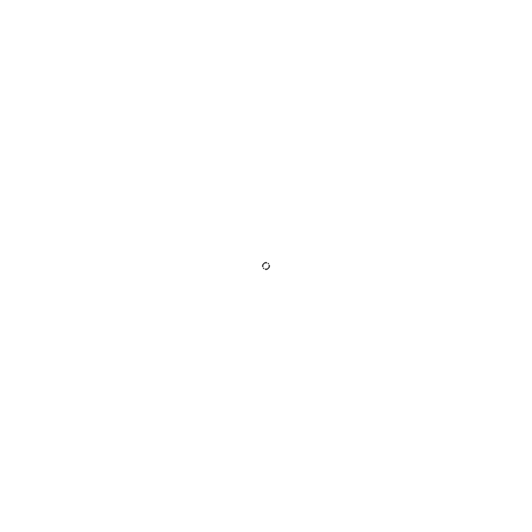

# poisson-disk-sampling
This is an implementation of the algorithm from the paper [Fast Poisson Disk Sampling in Arbitrary Dimensions](https://www.cs.ubc.ca/~rbridson/docs/bridson-siggraph07-poissondisk.pdf) realized with [Processing](https://processing.org/). [Poisson Disk Sampling](https://en.wikipedia.org/wiki/Supersampling#Poisson_disc) is the generation of a random distribution of points where no two points are too close, meaning that the points are at least a fixed distance apart. This form of distribution is also called [Blue Noise](https://en.wikipedia.org/wiki/Colors_of_noise#Blue_noise) which is useful in computer graphics, particularly for rendering or triangulations.

The following animation shows the 3D implementation shows the active points during the algorithm, which are responsible for generating the next samples.

The following animation shows the 2D implementation shows both the active points and the final points during the algorithm.

An implementation in JavaScript with [p5js](https://p5js.org/) can be found in [Daniel Shiffman](https://github.com/shiffman)'s [example](https://github.com/CodingTrain/Rainbow-Code/tree/master/challenges/CC_33_poisson_disc).
